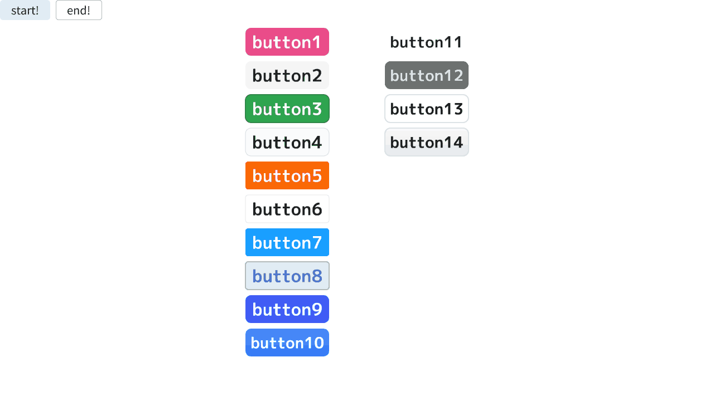

# SushiGUI

## Overview
- シンプルな記述でリッチなGUIを提供
- SimpleGUIの代替
- 現在Button1からButton14まで実装
## Usage
```cpp
Font font_button(48, Typeface::Bold);
if (SushiGUI::Button1(
  font_button,
  U"button1",
  Arg::center(Scene::CenterF()),
  Size{ 150, 50 }
)) {
  Print << U"button1";
}
```
- 画面の中心に大きさ150×50のボタンを描画するサンプル
- `SushiGUI::Button()`は、左クリックされたときに`true`を返す
## Reference
- デザイン参考: https://getcssscan.com/css-buttons-examples
## Author
Tamagosushio
